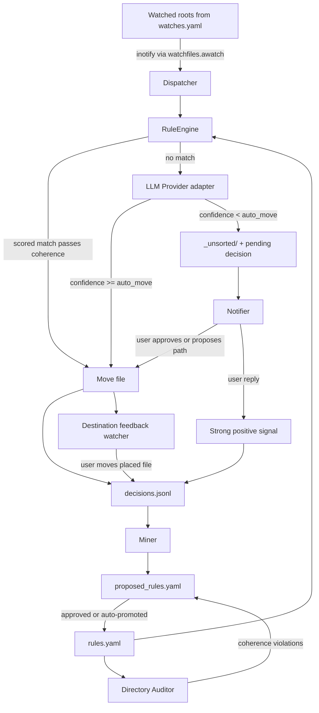

# Architecture

## High-level flow



## Hexagonal layering

The package is split into four layers with strict inward-only imports:

- [`taxonomaid.domain`][taxonomaid.domain]: pure types - frozen
  dataclasses, enums, error hierarchy. Zero internal dependencies.
- [`taxonomaid.ports`][taxonomaid.ports]: `typing.Protocol` interfaces
  for every external dependency.
- [`taxonomaid.services`][taxonomaid.services]: orchestration. Imports
  only ports and domain.
- `taxonomaid.adapters`: concrete implementations of ports. Imports only
  ports and domain.

[`taxonomaid.bootstrap`][taxonomaid.bootstrap.build_app] is the
**only** module that imports both ports and adapters; it builds wired
services from a validated `AppConfig`. The layering is enforced by
`import-linter` contracts in `pyproject.toml`; violations fail CI.

The decision is recorded as
[ADR 0001](adr/0001-hexagonal-layering.md).

## Rule schema

```yaml
- id: tax_pdf_to_year
  match:
    filename_regex: '(?i)\b(tax|irs|1040|w-?2)\b'
    ext: [.pdf]
  destination_template: 'Finance/Taxes/{year}/'
  coherence:
    year_match: true
  weight: 1.0
  anchored: true
  source: hand
  confidence: 1.0
  sample_count: 0
```

Selection: the dispatcher picks the rule with the highest
`weight * confidence` whose `coherence` checks pass. If none pass,
control hands off to the LLM.

See [`Rule`][taxonomaid.domain.Rule],
[`MatchSpec`][taxonomaid.domain.MatchSpec], and
[`CoherenceSpec`][taxonomaid.domain.CoherenceSpec].

## LLM provider abstraction

[`LLMProvider`][taxonomaid.ports.LLMProvider] is a single-method
protocol. The default adapter,
[`OpenAICompatProvider`][taxonomaid.adapters.llm.OpenAICompatProvider],
talks the OpenAI `/v1/chat/completions` schema. That covers Gemini
(default), OpenAI, Ollama, vLLM, LocalAI, and LM Studio - swapping is a
`base_url` change in `llm.yaml`.

## Notifier abstraction

The notifier is split into outbound (push) and inbound (replies):

- [`NotifierOutbound`][taxonomaid.ports.NotifierOutbound] is backed by
  [Apprise](https://github.com/caronc/apprise). Adding a channel
  (Telegram / Slack / Discord / ntfy / email / ...) is a URL change.
- [`NotifierInbound`][taxonomaid.ports.NotifierInbound] is per-backend.
  The shipped implementation,
  [`TelegramInbound`][taxonomaid.adapters.notifiers.TelegramInbound],
  is a long-poll listener over `httpx`, so no public URL is needed.

## Decision log

[`DecisionLog`][taxonomaid.ports.DecisionLog] is an append-only audit
log. The default adapter,
[`JsonlDecisionLog`][taxonomaid.adapters.decision_log.JsonlDecisionLog],
writes one JSON object per line so that miners can stream-replay it.

## Path-safety contract

Every destination from an external party (LLM response, rule template,
Telegram reply) goes through
[`safe_resolve`][taxonomaid.services.path_safety.safe_resolve] before
the dispatcher touches the filesystem.

Containment is the actual security check: the resolved path must live
under `destination_root`. The string syntax of the input determines
how aggressively we recover from malformed-but-not-malicious cases:

- **Absolute paths are salvaged.** `/Reports/Q1` is rewritten to
  `<destination_root>/Reports/Q1`. An absolute `/etc/passwd` joined
  against a `/srv/docs` watch root becomes `/srv/docs/etc/passwd`,
  which still passes containment - so it's accepted as a (silly)
  literal subfolder rather than rejected. Salvaging matches the real
  failure mode: an LLM that emits a leading `/` is confused about
  what "relative" means, not hostile.
- **`..` segments are rejected.** Any path that resolves outside
  `destination_root` returns `None`, and the dispatcher parks the file
  in `_unsorted/` with `unsorted_path.parent` as the proposed
  destination - so a Telegram APPROVE tap is a no-op rather than an
  escape attempt that landed.

[`collision_free_path`][taxonomaid.services.path_safety.collision_free_path]
lives in the same module. Every move pre-computes a non-overwriting
`foo (2).pdf` sibling, which is what guarantees no existing file is
ever clobbered.
